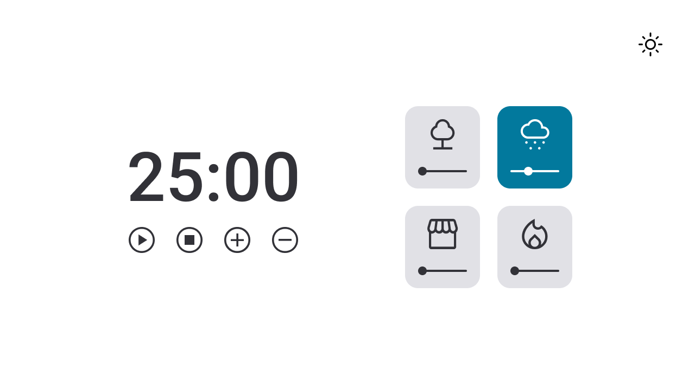
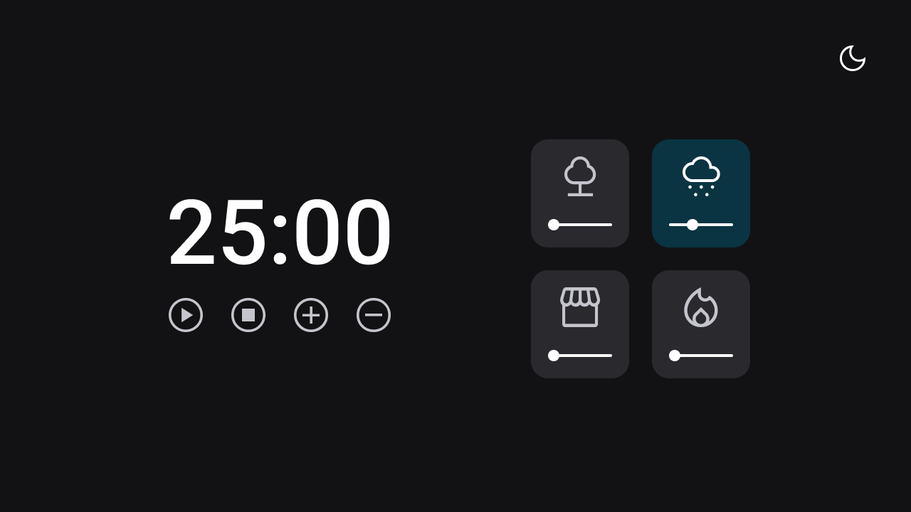

<h1 align="center"> <strong>Desafio: Focus Timer 2.0</strong> </h1>

Projeto realizado como desafio para criação de Pomodoro Timer, no qual o usuário pode além de usar o contador, também escutar músicas relaxantes. 

  <a href="#-tecnologias">Tecnologias</a>&nbsp;&nbsp;&nbsp;|&nbsp;&nbsp;&nbsp;
  <a href="#-projeto">Projeto</a>&nbsp;&nbsp;&nbsp;

 

  

  

## 🚀 Tecnologias

Esse projeto foi desenvolvido com as seguintes tecnologias:

- HTML
- CSS
- Git e Github
- Figma
- JavaScript

## 💻 Projeto

Cada card que se encontra do lado direito, quando selecionado, vai mudar de cor e emitir um som diferente.

- **Floresta**
- **Chuva**
- **Cafeteria**
- **Lareira**

Funcionalidades esperadas dos botões:

- Play: aciona o timer;
- Stop: para o timer;
- Mais: aumenta em mais 5 minutos o tempo do timer;
- Menos: diminui em 5 minutos o tempo do timer.

O site também possui suporte para **dispositivos móveis** e **modo escuro**.

O desafio foi proposto no curso Explorer da Rocketseat. A ideia é aplicar o que foi aprendido sobre vários temas, entre eles:

- Responsividade
- Programação Iperativa
- Programação Declarativa
- Recursão de funções
- Padrão Factory ( Organização código)
- Manipulação de aúdio

-----

Feito por: <strong>Elizandra Monteiro</strong>

<a 
href="https://ElizandraMonteiro.github.io/FocusTimer-2.0/">
<strong>Visite o projeto online</strong>
</a>
